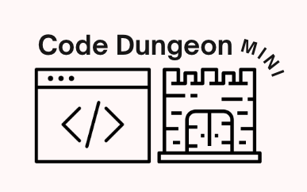
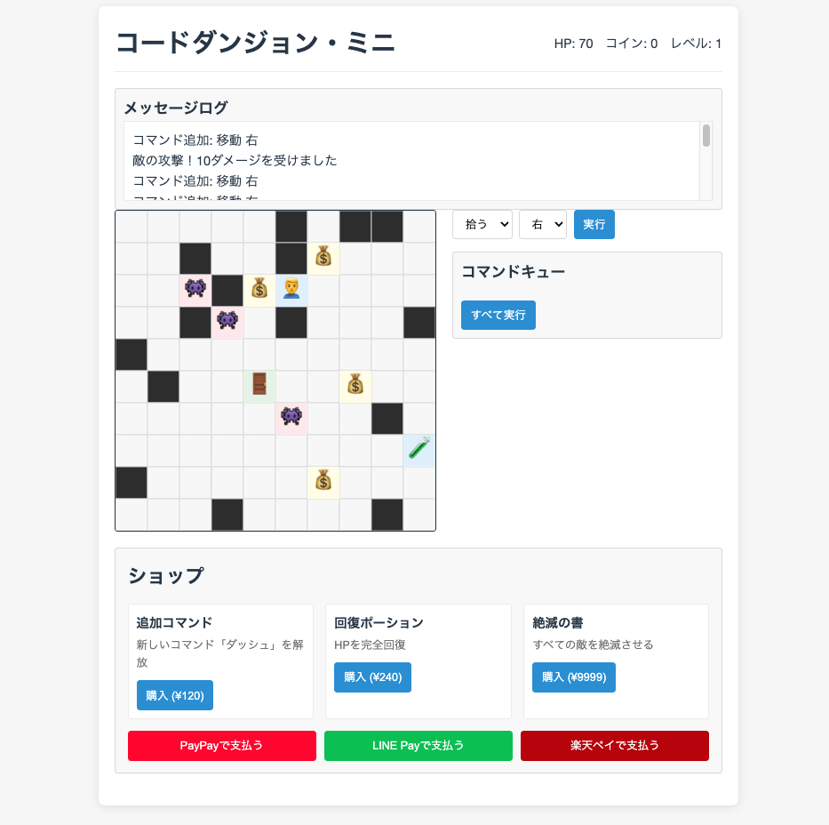
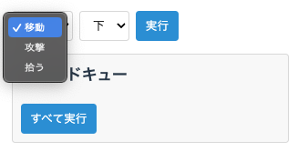
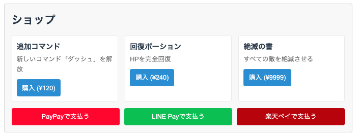
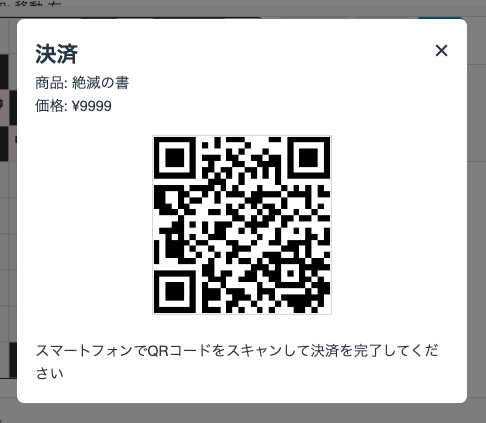

<div align="center">
  
  <h1>コードダンジョン・ミニ</h1>
  <p>日本の決済サービスに対応した超小規模ブラウザゲーム</p>
  
  <p>
    <a href="https://github.com/YushiYamamoto/code-dungeon-mini/blob/main/LICENSE">
      
    </a>
    <a href="https://nodejs.org/en/">
      
    </a>
    
  </p>
</div>

## 目次

- [概要](#概要)
- [ゲームイメージ](#ゲームイメージ)
- [主な特徴](#主な特徴)
- [技術スタック](#技術スタック)
- [インストール方法](#インストール方法)
- [使い方](#使い方)
- [決済機能のセットアップ](#決済機能のセットアップ)
- [アーキテクチャ](#アーキテクチャ)
- [ライセンス](#ライセンス)
- [著者](#著者)

## ゲームイメージ

<div align="center">
  
  <p><em>10×10グリッドのミニマルなダンジョン。プログラミング的思考で攻略!</em></p>
</div>

<div align="center">
  <table>
    <tr>
      <td align="center">
        
        <p><em>コマンド入力</em></p>
      </td>
      <td align="center">
        
        <p><em>アイテムショップ</em></p>
      </td>
      <td align="center">
        
        <p><em>QRコード決済</em></p>
      </td>
    </tr>
  </table>
</div>

## 主な特徴

- 🎮 **シンプルなゲームプレイ** - 10×10のミニマルなグリッドダンジョン
- 🧠 **プログラミング的思考** - コマンドを組み合わせて攻略する戦略性
- 🎲 **ローグライク要素** - ランダム生成されるダンジョンと敵
- 💰 **日本の主要決済サービス対応** - PayPay、LINE Pay、楽天ペイと連携
- 🛍️ **ゲーム内ショップ** - 追加コマンドなどの課金アイテム
- 📱 **レスポンシブデザイン** - モバイルとデスクトップに対応

## 技術スタック

<div align="center">
  <table>
    <tr>
      <th>フロントエンド</th>
      <th>バックエンド</th>
      <th>決済システム</th>
    </tr>
    <tr>
      <td>
        <br>
        <br>
        <br>
        
      </td>
      <td>
        <br>
        <br>
        
      </td>
      <td>
        <br>
        <br>
        
      </td>
    </tr>
  </table>
</div>

## インストール方法

<div align="center">
  <table>
    <tr>
      <td align="center">
        <br>
        <b>リポジトリのクローン</b>
      </td>
      <td>

```

git clone https://github.com/YushiYamamoto/code-dungeon-mini.git
cd code-dungeon-mini

```

  </td>
    </tr>
    <tr>
      <td align="center">
        <br>
        <b>依存パッケージのインストール</b>
      </td>
      <td>

```

npm install

```

  </td>
    </tr>
    <tr>
      <td align="center">
        <br>
        <b>開発サーバーの起動</b>
      </td>
      <td>

```

npm run dev

```

  </td>
    </tr>
  </table>
</div>

## 使い方

<div align="center">
  
</div>

1. 🌐 ブラウザで `http://localhost:3000` にアクセス
2. 🎮 コマンドを選択（移動、攻撃、アイテム使用など）
3. 🧩 コマンドキューに追加し、実行ボタンをクリック
4. 👾 敵を倒し、アイテムを集めながらダンジョンを探索
5. 🚪 出口を見つけて次のレベルへ進む
6. 💎 コインを集めて特殊能力やアイテムを購入

## 決済機能のセットアップ

<div align="center">
  
  <p><em>決済システムの基本フロー</em></p>
</div>

各決済サービスとの連携には、それぞれのアカウントとAPI認証情報が必要です：

1. **環境変数の設定**:
   `.env.example` をコピーして `.env` ファイルを作成し、以下の情報を設定します。

```


# .env ファイル

PAYPAY_API_KEY=your_paypay_api_key
LINE_PAY_CHANNEL_ID=your_line_pay_channel_id
LINE_PAY_CHANNEL_SECRET=your_line_pay_channel_secret
RAKUTEN_PAY_API_KEY=your_rakuten_pay_api_key
RAKUTEN_PAY_SERVICE_SECRET=your_rakuten_service_secret
RAKUTEN_PAY_SHOP_ID=your_rakuten_shop_id

```

2. **開発用のテスト決済**:
   開発中は各サービスのサンドボックス環境を利用できます。

## アーキテクチャ

<div align="center">
  
  <p><em>コードダンジョン・ミニのシステムアーキテクチャ</em></p>
</div>

## 著者

<div align="center">
  
  <h3>Yushi Yamamoto</h3>
  <p>フルスタックエンジニア / ゲーム開発者</p>
  
  <a href="https://github.com/YushiYamamoto">
    
  </a>
  <a href="https://twitter.com/yourhandle">
    
  </a>
</p>
</div>

このプロジェクトは、フルスタックエンジニアのスキルを示すポートフォリオとして作成されました。

## 貢献とフィードバック

<div align="center">
  
</div>

このプロジェクトへの貢献を歓迎します！バグ報告、機能リクエスト、プルリクエストなど、どんな形での参加も大歓迎です。

- バグを発見した場合は [Issue](https://github.com/YushiYamamoto/code-dungeon-mini/issues) を作成してください
- 新機能の提案は [Discussions](https://github.com/YushiYamamoto/code-dungeon-mini/discussions) で共有してください
- コードを改善したい場合は、プルリクエストをお送りください
